# Agentic Calendar Sync — Implementation Plan (v6 — Final)

> **Architecture:** FE Orchestrator + BE as pure LLM Gateway.  
> See `adr_001_sync_orchestration.md` for rationale.

---

## 1. Edge Case Decisions (Locked)

| # | Case | Decision |
|---|---|---|
| 1 | Task không có deadline / unresolved | **Non-blocking collection:** Hỏi user song song với các task đã có deadline. Task thiếu ngày vào queue riêng, merge lại sau khi user điền. |
| 2 | Google token expire giữa chừng | **Alert + dừng ngay:** Catch HTTP 401 bất kỳ đâu → "Phiên Google hết hạn" → abort. |
| 3 | LLM dedup fail (timeout/JSON lỗi) | **Fallback CREATE:** Bỏ qua dedup, tạo mới tất cả `myTasks`. Log warning. |
| 4 | PATCH 404 (event bị xóa externally) | **Report failed:** Thêm vào `failed[]`. Không retry. |
| 5a | RELATED (cùng task, khác ngày) | **DELETE old + CREATE new** (reschedule sạch). |
| 5b | DUPLICATE (cùng task, cùng ngày ≤2 ngày) | **PATCH title + description, giữ nguyên ngày.** |
| 6 | `otherTasks` (task của người khác) | **Bỏ qua hoàn toàn.** Lịch của mình chỉ chứa task của mình. Không CREATE cho người khác. |
| 7 | `assignee = null` (Unassigned) | **Hỏi user:** "Task này chưa có người đảm nhận. Có phải của bạn không?" → Yes → `myTasks` / No → bỏ qua. |
| 8 | Assignee là string nhiều người ("Bill, Seth") | **Split theo `,` hoặc `\band\b`, kiểm tra từng entity.** Nếu entity nào khớp `Me`/`userName` → vào `myTasks`. |
| 9 | `myTasks` rỗng sau filter **hoặc** `userName` chưa được set | **Cùng 1 câu hỏi duy nhất:** "Không tìm thấy task nào của bạn. Xử lý toàn bộ hay kết thúc?" → Toàn bộ: dùng tất cả tasks / Kết thúc: abort. |
| 10 | 1 task match với 2+ events | **Chọn event có ngày gần nhất VÀ Jaccard score cao nhất** (kết hợp 2 tiêu chí). Chỉ hỏi về event đó. |
| 11 | "Dời ngày" trong dialog conflict | **Date picker button** (không phải text input). Ngày trong quá khứ → badge cảnh báo nhỏ, vẫn cho bấm OK. |
| 12 | Sync đang chạy, user bấm Sync lại | **Disable nút** khi `agent.state !== 'idle'`. |
| 13 | Partial failure | **Hiện kết quả partial.** Không rollback. |
| 14 | Timezone | **`Asia/Ho_Chi_Minh`** cố định. |
| 15 | Event format | Title = task title (fallback "Action Item"). Description = task description + assignee + note. |

---

## 2. Node Graph (Final — v5)

```mermaid
flowchart TD
    START([START\nuser bấm Sync\ninputs: items, userName, googleToken]) --> P0

    subgraph PHASE0["Phase 0 — Pre-Sync (Non-blocking)"]
        P0["Tách tasks:\n• readyTasks: deadline hợp lệ\n• pendingTasks: không có deadline / unresolved"]
        P0 -->|pendingTasks không rỗng| DLQ["Deadline Collection Queue\nHiện panel nhỏ (non-modal)\nUser điền ngày hoặc Skip từng task"]
        DLQ -->|User xử lý xong| MERGE[Merge vào readyTasks]
        P0 -->|readyTasks| N1
        MERGE --> N1
    end

    N1["Node 1 — Pre-flight Validator\nKiểm tra format ngày (YYYY-MM-DD / DD/MM/YYYY)\nSau khi đã merge từ Phase 0"]
    N1 -->|Vẫn còn lỗi format| STOP1([STOP: Alert])
    N1 -->|OK| N2

    subgraph N2BLOCK["Node 2 — Me Filter"]
        N2A["Bước 1: Split assignee string theo ',' / 'and'\nKiểm tra từng entity vs Me / userName"]
        N2B["Bước 2: Task có assignee = null\n→ Hỏi user: 'Có phải task của bạn không?'\n→ Yes: vào myTasks / No: bỏ qua"]
        N2C["Bước 3: Phân loại\n• myTasks: entity khớp Me/userName\n• otherTasks: BỎ QUA HOÀN TOÀN (không sync)"]
        N2D{"myTasks rỗng?"}
        N2E["Hỏi user 1 lần:\n'Không tìm thấy task của bạn.\nXử lý toàn bộ hay kết thúc?'"]
        N2A --> N2B --> N2C --> N2D
        N2D -->|Có| N2E
        N2E -->|Toàn bộ| N2F[Dùng tất cả tasks làm myTasks]
        N2E -->|Kết thúc| STOP2([STOP: Abort sync])
        N2D -->|Không| N3
        N2F --> N3
    end
    N1 --> N2BLOCK

    N3["Node 3 — Event Fetcher\nGọi Google Calendar API trực tiếp\ntimeWindow = min(deadlines) → +30 ngày\n→ existingEvents[]"]
    N3 -->|401| AUTH_ERR([STOP: Alert — Token hết hạn])
    N3 --> N3H

    N3H["Node 3.5 — Heuristic Pre-filter\nJaccard similarity trên title tokens\nThreshold ≥ 0.3 → candidatePairs[]\nTối đa 20 cặp gửi lên LLM"]
    N3H -->|candidatePairs rỗng| N6
    N3H -->|candidatePairs có data| N4

    N4["Node 4 — Semantic Deduplicator\nGửi candidatePairs lên BE\nBE gọi LLM → conflicts[]\n(DUPLICATE / RELATED)"]
    N4 -->|LLM fail / timeout| FALLBACK[Fallback: myTasks → CREATE hết]
    FALLBACK --> N6
    N4 --> F{Có conflicts?}
    F -->|Không| N6
    F -->|Có| N5

    N5["Node 5 — Clarification Dialog\nHỏi từng conflict:\n• RELATED → Date Picker button để chọn ngày mới\n  (cảnh báo nếu ngày quá khứ, vẫn cho OK)\n• DUPLICATE → Cập nhật nội dung / Bỏ qua"]
    N5 -->|"Dời ngày (date picker)"| ACT_R[intent: RESCHEDULE]
    N5 -->|Cập nhật nội dung| ACT_P[intent: PATCH]
    N5 -->|Tạo mới riêng| ACT_C[intent: CREATE]
    N5 -->|Bỏ qua| ACT_S[intent: SKIP]
    ACT_R & ACT_P & ACT_C & ACT_S --> N6

    N6["Node 6 — Intent Router\nKết hợp myTasks sau dialog\n→ finalPlan: list of {task, intent, targetEventId?}"]
    N6 --> N7

    N7["Node 7 — Calendar Executor\n• CREATE → POST googleapis.com/...\n• RESCHEDULE → DELETE + POST\n• PATCH → PATCH googleapis.com/.../events/{id}\n• SKIP → bỏ qua\nCatch 401 → abort. Catch 404 → report failed."]
    N7 --> N8

    N8["Node 8 — Result Aggregator\ncreated[] / updated[] / skipped[] / failed[]"]
    N8 --> DONE([END: Hiện CalendarSyncResult])
```



---

## 3. Node 2 — Me Filter Logic Chi Tiết

```javascript
// nodes/meFilter.js
const splitAssignees = (assigneeStr) => {
  if (!assigneeStr) return [];
  return assigneeStr
    .split(/,|\band\b/i)
    .map(s => s.trim())
    .filter(Boolean);
};

const isSelf = (name, userName) => {
  const n = (name || '').toLowerCase().trim();
  return n === 'me' || (userName && n === userName.toLowerCase().trim());
};

export const meFilter = async (items, userName, askUserFn) => {
  const myTasks = [];
  const skipped = [];

  for (const item of items) {
    const assignees = splitAssignees(item.assignee);

    if (assignees.length === 0) {
      // assignee = null → hỏi user
      const isOwner = await askUserFn(`"${item.title || 'Task'}" chưa có người đảm nhận. Có phải của bạn không?`);
      if (isOwner) myTasks.push(item);
      else skipped.push(item);
      continue;
    }

    if (assignees.some(a => isSelf(a, userName))) {
      myTasks.push(item);
    } else {
      // otherTasks → bỏ qua hoàn toàn, không sync
      skipped.push(item);
    }
  }

  return { myTasks, skipped };
};
```

---

## 4. Node 3.5 — Heuristic Pre-filter

```javascript
// nodes/heuristicFilter.js
const STOPWORDS = new Set(['the','a','an','and','or','to','for','with','in','on','of','is','are','will','be']);

const tokenize = (text) =>
  (text || '').toLowerCase()
    .replace(/[^a-z0-9\s]/g, '')
    .split(/\s+/)
    .filter(w => w.length > 2 && !STOPWORDS.has(w));

const jaccard = (a, b) => {
  const sA = new Set(a), sB = new Set(b);
  const inter = [...sA].filter(x => sB.has(x)).length;
  const union = new Set([...sA, ...sB]).size;
  return union === 0 ? 0 : inter / union;
};

export const heuristicFilter = (myTasks, existingEvents, threshold = 0.3) => {
  const candidates = [];

  for (const task of myTasks) {
    const taskTokens = tokenize(task.title);
    const scored = existingEvents
      .map(event => ({
        task,
        event,
        score: jaccard(taskTokens, tokenize(event.summary || event.title || ''))
      }))
      .filter(p => p.score >= threshold)
      .sort((a, b) => {
        // Tiêu chí 1: Jaccard score cao nhất
        if (b.score !== a.score) return b.score - a.score;
        // Tiêu chí 2: ngày gần nhất (nếu score bằng nhau)
        const taskDate = new Date(task.deadline || 0).getTime();
        const dA = Math.abs(new Date(a.event.start?.date || a.event.start?.dateTime || 0).getTime() - taskDate);
        const dB = Math.abs(new Date(b.event.start?.date || b.event.start?.dateTime || 0).getTime() - taskDate);
        return dA - dB;
      });

    // Mỗi task chỉ lấy top-1 event khả nghi nhất
    if (scored.length > 0) candidates.push(scored[0]);
  }

  return candidates; // max = số myTasks, không cần slice
};
```

---

## 5. Backend Endpoint — `POST /api/v1/calendar/check-conflicts`

**Request** (chỉ gửi candidatePairs):
```json
{
  "candidate_pairs": [
    {
      "task_id": 0,
      "task_title": "Prepare talent assessment",
      "task_deadline": "2026-12-15",
      "event_id": "gcal_abc123",
      "event_title": "Talent Review",
      "event_start": "2026-12-13"
    }
  ]
}
```

**Response:**
```json
{
  "conflicts": [
    {
      "task_id": 0,
      "event_id": "gcal_abc123",
      "verdict": "RELATED",
      "reason": "Both refer to talent assessment. Dates differ by 2 days.",
      "suggested_action": "ask_reschedule"
    }
  ]
}
```

| Verdict | Điều kiện | Dialog |
|---|---|---|
| `DUPLICATE` | Cùng task, ngày ≤2 ngày | Cập nhật nội dung / Bỏ qua |
| `RELATED` | Cùng task, ngày >2 ngày | **Date picker** để chọn ngày mới / Tạo mới / Bỏ qua |

---

## 6. Agent Hook API

```javascript
const agent = useCalendarSyncAgent()

agent.run(selectedItems, userName, googleToken)

// State
agent.state              // SYNC_STATES enum
agent.progress           // { phase, current, total }
agent.pendingDeadlines   // tasks[] thiếu ngày (Phase 0)
agent.pendingOwnership   // task | null (Node 2: hỏi assignee null)
agent.pendingMyTasksEmpty // bool (Node 2: myTasks rỗng)
agent.pendingDialog      // { conflict, verdict } | null (Node 5)
agent.result             // { created[], updated[], skipped[], failed[] }

// Callbacks
agent.submitDeadline(taskId, date)      // Phase 0
agent.skipDeadline(taskId)             // Phase 0
agent.respondOwnership(taskId, isOwner) // Node 2 null assignee
agent.respondEmptyFilter(processAll)    // Node 2 myTasks rỗng
agent.respondConflict(intent, newDate?) // Node 5: 'reschedule'|'patch'|'create'|'skip'
```

---

## 7. File Structure

```
frontend/src/
  agents/
    calendarSyncAgent.js        ← FSM controller (useCalendarSyncAgent hook)
    nodes/
      deadlineCollector.js      ← Phase 0
      preflightValidator.js     ← Node 1
      meFilter.js               ← Node 2 (split, ask null, ask empty)
      eventFetcher.js           ← Node 3
      heuristicFilter.js        ← Node 3.5
      semanticDeduplicator.js   ← Node 4
      intentRouter.js           ← Node 6
      calendarExecutor.js       ← Node 7 (CREATE/RESCHEDULE/PATCH/SKIP)
      resultAggregator.js       ← Node 8
    googleCalendarApi.js        ← Wrapper: GET/POST/PATCH/DELETE GCal REST
  components/
    ActionItemTable.jsx         ← Nhận thêm: userName, googleToken
    CalendarSyncDialog.jsx      ← All dialogs: deadline, ownership, empty, conflict
    CalendarSyncResult.jsx      ← Kết quả cuối

backend/routers/
  calendar.py                   ← Thêm: POST /check-conflicts (LLM only)
```

---

## 8. Implementation Order

1. `googleCalendarApi.js` — GCal REST wrapper (GET/POST/PATCH/DELETE)
2. `nodes/preflightValidator.js` + `nodes/meFilter.js` + `nodes/heuristicFilter.js`
3. `nodes/eventFetcher.js` + `nodes/intentRouter.js` + `nodes/calendarExecutor.js` + `nodes/resultAggregator.js`
4. `CalendarSyncResult.jsx`
5. `calendarSyncAgent.js` — FSM baseline (không có dedup, Phase 0, dialogs)
6. **BE:** `POST /api/v1/calendar/check-conflicts`
7. `nodes/semanticDeduplicator.js` + `nodes/deadlineCollector.js`
8. `CalendarSyncDialog.jsx` — tất cả dialog types
9. Tích hợp đầy đủ FSM + dialogs
10. Kết nối `ActionItemTable.jsx` ← `useCalendarSyncAgent`

---

## 9. Rubric Checklist

| Yêu cầu Rubric | Cách đáp ứng |
|---|---|
| Multi-step reasoning | Phase 0 + 8 node tuần tự với conditional branching |
| Tool usage | Google Calendar REST API (GET/POST/PATCH/DELETE), Kaggle LLM qua BE |
| Decision-making từ intermediate output | Heuristic score → LLM verdicts → Intent Router → Executor |
| Clarifying questions | Phase 0 (deadline), Node 2 (ownership/empty), Node 5 (conflict resolution) |
| Agent architecture | `useCalendarSyncAgent` FSM hook với 10+ exposed state fields |
